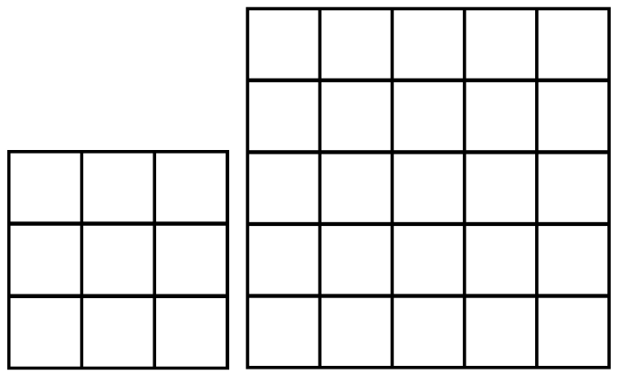
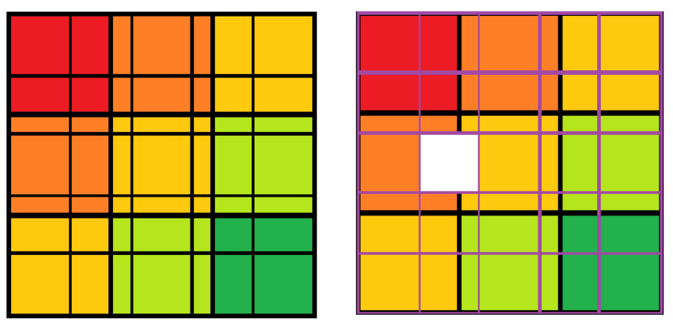
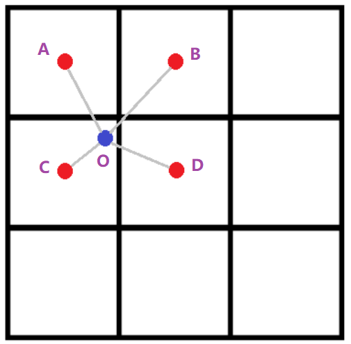
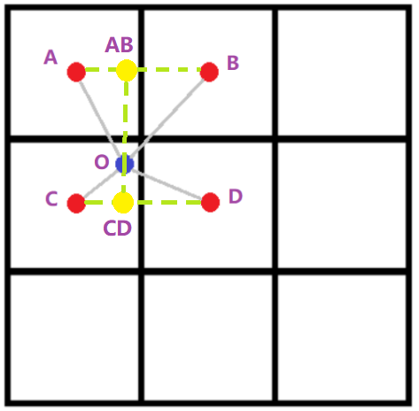

- Attention please: 

- **If you want to reprint my article, please mark the original address and author(刘书裴).**

- **If you are puzzled about a certain part or have some better suggestions, you can contact me: [3017218062@tju.edu.cn]()/[1005968086@qq.com]()**

- **If my blog has mistakes, I'm so sorry!**

- **I think and write everything. Please don't copy.**

- **Thanks for watching!**

| item | tool |
| :---: | :---: |
| image | mspaint |
| formula | Online LaTeX Equation Editor |
| language | python3.7 |

# Directory

1. [Nearest Interpolation](#1)
    1. [Algorithm](#1.1)
        1. [Coordinate mapping](#1.1.1)
        2. [Fill the nearest](#1.1.2)
    2. [Attention](#1.2)
        1. [Why we create two coordinate systems?](#1.2.1)
        2. [Why we add 0.5 to virtualPixel?](#1.2.2)
    3. [Result](#1.3)
2. [Bilinear Interpolation](#2)
    1. [Algorithm](#2.1)
        1. [Coordinate mapping](#1.1.1)
        2. [Find the neighbors](#2.1.2)
        3. [Compute interpolation](#2.1.3)
    2. [Attention](#2.2)
        1. [How to delete the neighbors out of bounds?](#2.2.1)
    3. [Optimization](#2.3)
        1. [Use matrix to calculate](#2.3.1)
    4. [Result](#2.4)

# 1. Nearest Interpolation
<a id="1"/>

## {1} Algorithm
<a id="1.1"/>

### [1] Coordinate mapping
<a id="1.1.1"/>

#### (1) For example:

- Here is the pixel distribution of the two pictures(src:3x3 and dst:5x5):



- Then overlap two pictures:



- Choose the white pixel and  calculate it:

```
1. Take the boundary pixel of the upper left corner as the origin (0,0).
    For the destination matrix, the pixel I choose is (2,1).
        realPixel1 = (2, 1)
    Calculate the ratio between src and dst:
        heightRatio = srcHeight / dstHeight = 0.6
        widthRatio = srcWidth / dstWidth = 0.6
2. Take the boundary point of the upper left corner as the origin (0,0).
    For the white pixel, its coordinate in destination matrix is (2.5,1.5):
        realPixel2 = (2.5, 1.5) => _realPixel2 = realPixel1 + (0.5, 0.5)
3. Converts coordinates from the dst coordinate system to the src coordinate system:
        virtualPixel2 = realPixel2 * (heightRatio, widthRatio) = (1.5, 0.9)
        virtualPixel1 = (1.0, 0.4) => virtualPixel1 = virtualPixel2 - (0.5, 0.5)
4. In summary:
    virtualPixel = (realPixel + 0.5) * (heightRatio, WidthRatio) - 0.5
```

### [2] Fill the nearest
<a id="1.1.2"/>

For nearest, we only need to take the rounding value of the corresponding coordinates.

```
nearestPixel = int(virtualPixel + 0.5)
```

## {2} Attention
<a id="1.2"/>

### [1] Why we create two coordinate systems?
<a id="1.2.1"/>

If we choose single coordinate system like pixel coordinate, the virtualPixel(realPixel*ratio) may be out of bounds when the radtio is greater than or equal to 0.5. For point coordinate, it can't represents the pixel between two points.

As an example:

```
for the realPixel (src:3x3,dst:6x6)
    int((5,5)*0.5)=int((2.5,2.5))=(3,3) is out of range(0,3).

```

### [2] Why we add 0.5 to virtualPixel?
<a id="1.2.2"/>

For many programming languages, they can remove data after decimal point when they change the type of float to int.

And Adding 0.5 can a number greater than or equal to 0.5 to add 1 to its integer.

## {3} Result
<a id="1.3"/>


# 2. Bilinear Interpolation
<a id="2"/>

## {1} Algorithm
<a id="2.1"/>

### [1] [Coordinate mapping](#1.1.1)

### [2] Find the neighbors
<a id="2.1.2"/>



For a virtualPixel O(x,y), its neighbors are 
- A(int(x),int(y))
- B(int(x),int(y+1))
- C(int(x+1),int(y))
- D(int(x+1),int(y+1)).

Specially, for boundary pixels, I delete the neighbors out of bounds.

### [3] Compute interpolation
<a id="2.1.3"/>

At first, we should know that the order of interpolation has no effect on the result.

- Assume that A(x1,y1), B(x1,y2), C(x2,y1), D(x2,y2), O(x,y).



- For A and B,


- For C and D,


- For AB and CD,


## {2} Attention
<a id="2.2"/>

### [1] How to delete the neighbors out of bounds?
<a id="2.2.1"/>

```
Obviously:
    xUp<=xDown and yLeft<=yRight
From virtualPixel = (realPixel + 0.5) * (heightRatio, WidthRatio) - 0.5, we can know:
    -0.5<x<height-0.5 and -0.5<y<width-0.5

If (xUp<0 or yLeft<0):
    Look at the int(x), int(y), int(x)>=0 and int(y)>=0.
    So (xUp<0 or yLeft<0) is False, and we don't need to deal with it.
If (xDown>height-1 or yRight>width-1):
    There is a x or a y, int(x+1)>height-1 and int(y+1)>width-1.
    So we need to substract 1 from xDown or yRight out of bounds.
```

## {3} Optimization
<a id="2.3"/>

### [1] Use matrix to calculate
<a id="2.3.1"/>

Thanks for [展希希鸿's blog](https://blog.csdn.net/qq_28266311/article/details/86293713). On this basis, I improve the algorithm and improve its generalization ability.

#### (1) Basic algorithm

- Assume that A(0,0), B(0,1), C(1,0), D(2,2), O(x,y).

- We can get the formula:


- Then we replace it with matrix:


#### (2) My improvement

The Basic algorithm is for special cases. So we can't directly use it.

However, the coordinates can be translated. So we can translate A/B/C/D/O to coordinates between 0 and 1.

To be convenient, we only need to change O with x%1 and y%1.

## {3} Result


